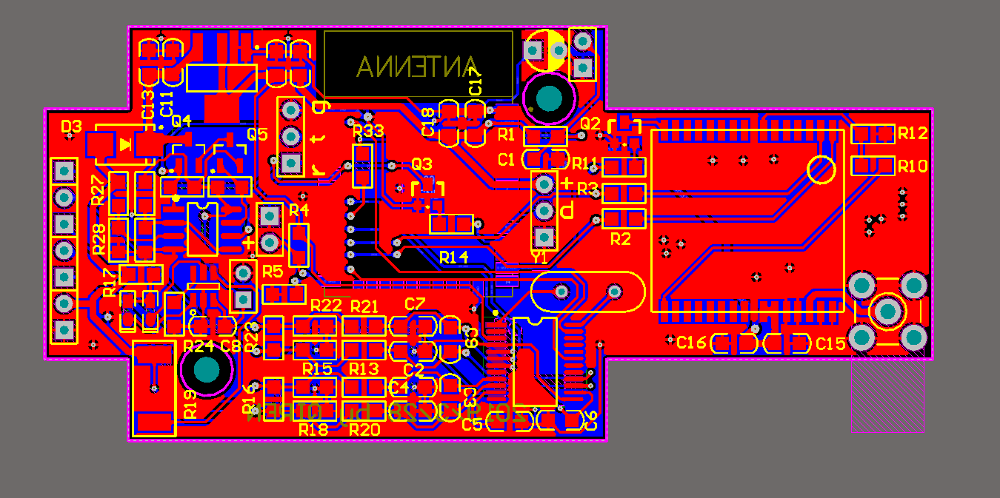
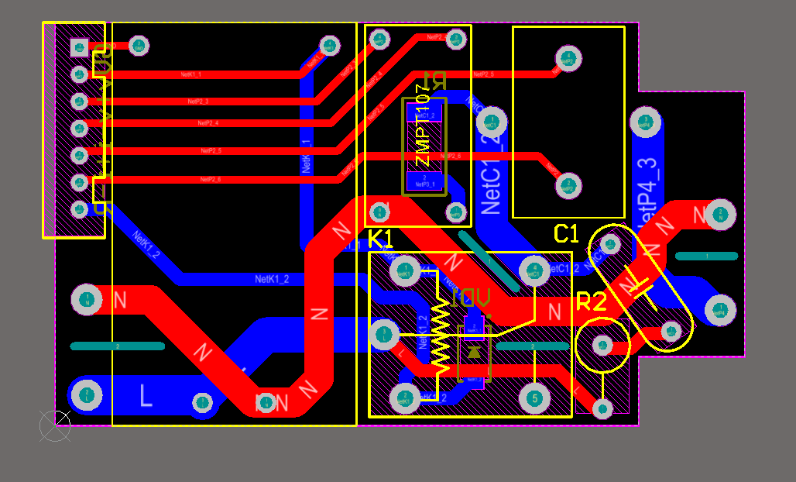

# Data-collector

该项目是基于esp32的micropython开发，目的是要做电力的监控。它可以采集基本的电压，电流，功率，温度，湿度，开关量等数据，同时可以通过网络远程控制继电器来控制排插的开关。我负责的大部分的硬件选型设计和硬件程序的开发，micropython的底层支持，数据加密，数据库，服务器，网页则由[Juwan](https://github.com/junhuanchen)大佬负
责。这个版本还不是最终版有很多优化的空间

* ## 硬件部分  

>>### 主控和联网

由于考虑到实际的情况和一些特殊的要求，采用的是ESP32+M5310A方案，也就是同时存在WIFI和NBIOT，选择esp32做主控的原因除了它可以运行micropython提高开发效率，还因为它自带wifi只要连上网络就可以upip，自我更新程序(这部分有待后面完善)。选择M5310A是因为这个模块应用时比较广泛的，移动的信号覆盖也比较好。wifi和nbiot都可以用在物联网上面，但是两者的应用场景是不一样的。nbiot主打的就是低功耗和覆盖广，但它的缺点也很明显那就是流量不便宜，数据传输的时延也比较大，所以它只适合做数据量小的，非强实时的数据传输，比如在电力抄表的应用上一般是15分钟发送一次数据。wifi传输的速度快，时延小，适合高频率的，数据量大的传输，esp32的WiFi数据传输速率高达150 Mbps，实测最快也差不多有2MB/s，缺点就是功耗大，供电设计要注意些。

>>### 电能采集

电能采集有两个方案，一个是CS5460A，一个是锐能微的RN8302B，cs5460a的驱动已经够用了，而rn8302b的驱动开发还在完善，目前只完成了A、B、C、N 4路电流的读取，由于缺少高精度的校准仪器，两个方案的精度稍微有点欠缺。cs5460a采集的是单相电，rn8302b采集的是三相电。

>>### 供电部分

供电考虑到断电的时候系统还要工作一断时间，所以采用了锂电池做备用电源，这部分电路的设计遇到很多问题，在查阅了很多方法后，采用的是锂电池供电和用电压比较器lm393+pmos来做主电源和备用电源的切换，同时在结束工作时用pmos管来切断备用电源。

* ## 软件程序

>> ### esp32 micropython固件

固件: <https://github.com/BPI-STEAM/BPI-BIT-MicroPython>

>>### 硬件驱动程序

   详细见source

>>### 通信加密

   加密传输数据 crc+base128+rsa

>>### 日志系统

   日志系统保存系统的错误信息

* ## 原理图和PCB  

   主控电路原理图:
   

   电源和控制部分:
   

   主控电路pcb：
   

   电源和控制部分pcb:
   

* ## 感谢
